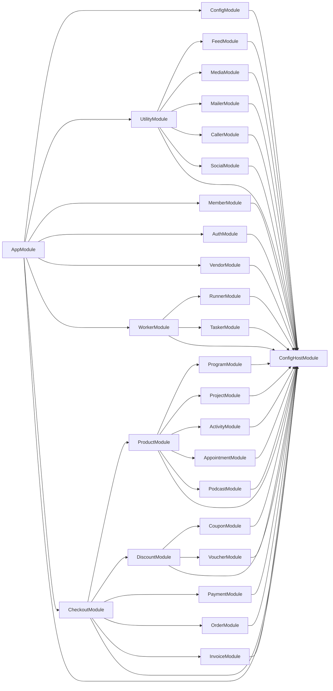

```mermaid
graph LR
	AppModule-->ConfigModule
	ConfigModule-->ConfigHostModule
	AppModule-->UtilityModule
	UtilityModule-->FeedModule
	FeedModule-->ConfigHostModule
	UtilityModule-->MediaModule
	MediaModule-->ConfigHostModule
	UtilityModule-->MailerModule
	MailerModule-->ConfigHostModule
	UtilityModule-->CallerModule
	CallerModule-->ConfigHostModule
	UtilityModule-->SocialModule
	SocialModule-->ConfigHostModule
	UtilityModule-->ConfigHostModule
	AppModule-->MemberModule
	MemberModule-->ConfigHostModule
	AppModule-->AuthModule
	AuthModule-->ConfigHostModule
	AppModule-->VendorModule
	VendorModule-->ConfigHostModule
	AppModule-->WorkerModule
	WorkerModule-->RunnerModule
	RunnerModule-->ConfigHostModule
	WorkerModule-->TaskerModule
	TaskerModule-->ConfigHostModule
	WorkerModule-->ConfigHostModule
	AppModule-->CheckoutModule
	CheckoutModule-->ProductModule
	ProductModule-->ProgramModule
	ProgramModule-->ConfigHostModule
	ProductModule-->ProjectModule
	ProjectModule-->ConfigHostModule
	ProductModule-->ActivityModule
	ActivityModule-->ConfigHostModule
	ProductModule-->AppointmentModule
	AppointmentModule-->ConfigHostModule
	ProductModule-->PodcastModule
	PodcastModule-->ConfigHostModule
	ProductModule-->ConfigHostModule
	CheckoutModule-->DiscountModule
	DiscountModule-->CouponModule
	CouponModule-->ConfigHostModule
	DiscountModule-->VoucherModule
	VoucherModule-->ConfigHostModule
	DiscountModule-->ConfigHostModule
	CheckoutModule-->PaymentModule
	PaymentModule-->ConfigHostModule
	CheckoutModule-->OrderModule
	OrderModule-->ConfigHostModule
	CheckoutModule-->InvoiceModule
	InvoiceModule-->ConfigHostModule
	CheckoutModule-->ConfigHostModule
	AppModule-->ConfigHostModule
```